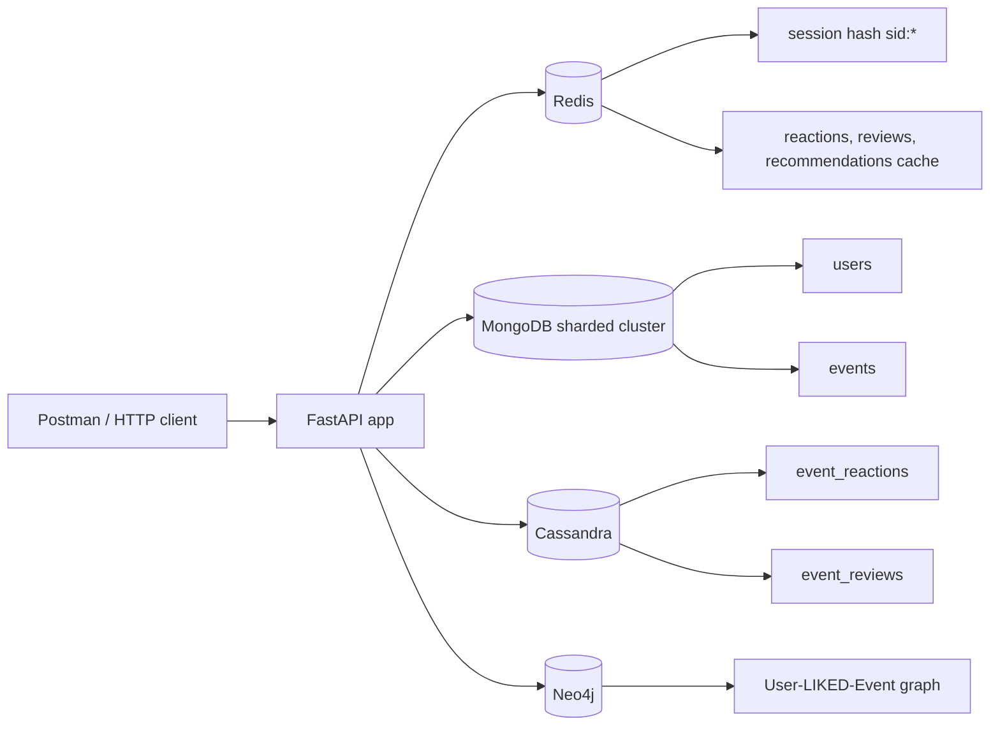

# EventHub - NoSQL Database Project

[](https://github.com/ElinkaD/NoSQL_ITMO/actions/workflows/eventhub.yml)

EventHub - backend-сервис платформы мероприятий для практического изучения NoSQL-хранилищ. Проект развивается по этапам в рамках лабораторных работ и сохраняет совместимость с предыдущими версиями сервиса.

## Технологический стек

| Компонент | Использование |
| --- | --- |
| Python 3 | основной язык приложения |
| FastAPI | HTTP API и маршрутизация |
| Uvicorn | ASGI-сервер внутри Docker-контейнера |
| MongoDB 8.0 sharded cluster | пользователи и мероприятия |
| Redis 7 | сессии и cache-aside кеши |
| Cassandra 5.0 | реакции и отзывы к мероприятиям |
| Neo4j 5 | граф лайков для рекомендаций |
| Docker Compose | локальный запуск приложения и хранилищ |
| bcrypt | хеширование паролей |
| pymongo, redis, cassandra-driver, neo4j | клиенты баз данных |

## Архитектура проекта

```text
app/
  main.py                 FastAPI-приложение, роутеры, обработчики ошибок
  config.py               чтение переменных окружения
  db.py                   подключения к Redis, MongoDB, Cassandra, Neo4j
  sessions.py             healthcheck и анонимные/пользовательские сессии
  users.py                регистрация, login/logout, карточки пользователей
  events.py               создание, поиск, карточки и редактирование событий
  reactions.py            реакции, агрегация и кеш счетчиков
  reviews.py              отзывы, summary и кеш агрегатов
  recommendations.py      рекомендации на основе графа лайков
  event_serializers.py    единый формат ответа события
api/                      Postman-коллекция с примерами запросов
cassandra/                init-скрипт keyspace и таблиц
mongodb/                  init-скрипт sharded cluster
docker-compose.yml        инфраструктура проекта
```



Основные сущности:

| Сущность | Где хранится | Назначение |
| --- | --- | --- |
| User | MongoDB, Neo4j | пользователь, авторизация, вершина графа рекомендаций |
| Event | MongoDB, Neo4j | мероприятие, поиск, карточка, вершина графа рекомендаций |
| Session | Redis | `X-Session-Id`, TTL и связь с авторизованным пользователем |
| Reaction | Cassandra, Redis cache, Neo4j | like/dislike пользователя к мероприятию |
| Review | Cassandra, Redis cache | отзыв пользователя и агрегированный рейтинг |

## Функциональные требования / Use Cases

- Пользователь может создать анонимную сессию, зарегистрироваться, войти и выйти из аккаунта.
- Авторизованный пользователь может создавать мероприятия и редактировать свои события.
- Любой пользователь может искать пользователей и мероприятия по фильтрам.
- Авторизованный пользователь может ставить лайк или дизлайк мероприятию.
- Авторизованный пользователь может оставить один отзыв на мероприятие и редактировать его.
- Списки и карточки мероприятий могут возвращать агрегаты `reactions` и `reviews` через параметр `include`.
- Авторизованный пользователь может получить рекомендации мероприятий на основе лайков похожих пользователей.

## API

Postman-коллекция с примерами запросов и ответов размещена в [api/52399890-60f7994f-573a-4e39-8b98-ce0c23e4e595.json](api/52399890-60f7994f-573a-4e39-8b98-ce0c23e4e595.json).

Базовый URL локального запуска:

```text
http://localhost:8080
```

Основные endpoint'ы:

| Метод | Путь | Назначение |
| --- | --- | --- |
| `GET` | `/health` | проверка состояния приложения |
| `POST` | `/session` | создать или продлить сессию |
| `POST` | `/users` | зарегистрировать пользователя |
| `GET` | `/users` | список пользователей |
| `GET` | `/users/{id}` | карточка пользователя |
| `GET` | `/users/{id}/events` | события пользователя |
| `POST` | `/auth/login` | вход |
| `POST` | `/auth/logout` | выход |
| `POST` | `/events` | создать мероприятие |
| `GET` | `/events` | список мероприятий |
| `GET` | `/events/{id}` | карточка мероприятия |
| `PATCH` | `/events/{id}` | редактировать свое мероприятие |
| `POST` | `/events/{event_id}/like` | поставить лайк |
| `POST` | `/events/{event_id}/dislike` | поставить дизлайк |
| `POST` | `/event/{event_id}/like` | alias для autograder |
| `POST` | `/event/{event_id}/dislike` | alias для autograder |
| `POST` | `/events/{event_id}/reviews` | создать отзыв |
| `GET` | `/events/{event_id}/reviews` | список отзывов |
| `PATCH` | `/events/{event_id}/reviews/{review_id}` | редактировать свой отзыв |
| `GET` | `/recommendations` | рекомендации для текущего пользователя |

Поддерживаемые query-параметры списков:

- `limit`, `offset`
- `id`, `title`, `category`, `price_from`, `price_to`, `city`, `user`
- `date_from`, `date_to` в формате `YYYY-MM-DD`
- `include=reactions`, `include=reviews`, `include=reactions,reviews`

Примеры запросов:

```bash
curl -i http://localhost:8080/health
```

```json
{"status":"ok"}
```

```bash
curl -i -X POST http://localhost:8080/users \
  -H "Content-Type: application/json" \
  -d '{"full_name":"Elina Dusaeva","username":"elina","password":"secret"}'
```

```http
HTTP/1.1 201 Created
Set-Cookie: X-Session-Id=<sid>; HttpOnly; Path=/; Max-Age=60
```

```bash
curl -i -X POST http://localhost:8080/events \
  -H "Cookie: X-Session-Id=<sid>" \
  -H "Content-Type: application/json" \
  -d '{"title":"NoSQL meetup","address":"Kronverksky pr. 49","city":"Saint Petersburg","started_at":"2026-06-10T10:00:00Z","finished_at":"2026-06-10T12:00:00Z","category":"education","price":0,"description":"Database meetup"}'
```

```json
{"id":"665f1d4f1f7a2a0012a00001"}
```

```bash
curl -i "http://localhost:8080/events/<event_id>?include=reactions,reviews"
```

```json
{
  "id": "665f1d4f1f7a2a0012a00001",
  "title": "NoSQL meetup",
  "location": {"address": "Kronverksky pr. 49", "city": "Saint Petersburg"},
  "created_at": "2026-06-06T10:00:00Z",
  "created_by": "<user_id>",
  "started_at": "2026-06-10T10:00:00Z",
  "finished_at": "2026-06-10T12:00:00Z",
  "category": "education",
  "price": 0,
  "description": "Database meetup",
  "reactions": {"likes": 1, "dislikes": 0},
  "reviews": {"count": 1, "rating": 5.0}
}
```

## Инструкция по запуску
Запуск всех сервисов:

```bash
make run
```

Проверка состояния контейнеров:

```bash
make services
```

Остановка:

```bash
make stop
```

Полная очистка контейнеров и volume:

```bash
make clean
```

После запуска приложение доступно на `http://localhost:8080`.

## Конфигурация

Основной конфигурационный файл проекта - `.env.local`.

| Переменная | Описание | Значение по умолчанию |
| --- | --- | --- |
| `APP_HOST` | host приложения | `localhost` |
| `APP_PORT` | порт приложения | `8080` |
| `APP_USER_SESSION_TTL` | TTL пользовательской сессии в секундах | `60` |
| `APP_LIKE_TTL` | TTL кеша реакций в секундах | `60` |
| `APP_EVENT_REVIEWS_TTL` | TTL кеша summary отзывов в секундах | `120` |
| `APP_RECOMMENDATIONS_TTL` | TTL кеша рекомендаций в секундах | `60` |
| `REDIS_HOST` | host Redis внутри compose-сети | `redis` |
| `REDIS_PORT` | порт Redis | `6379` |
| `REDIS_PASSWORD` | пароль Redis | `rediselina2003` |
| `REDIS_DB` | номер Redis DB | `0` |
| `REDIS_SOCKET_CONNECT_TIMEOUT` | timeout подключения к Redis | `2` |
| `REDIS_SOCKET_TIMEOUT` | socket timeout Redis | `2` |
| `MONGODB_DATABASE` | база приложения | `eventhub` |
| `MONGODB_USER` | пользователь MongoDB для приложения | пусто |
| `MONGODB_PASSWORD` | пароль MongoDB для приложения | пусто |
| `MONGODB_HOST` | host mongos | `mongos` |
| `MONGODB_PORT` | порт mongos | `27017` |
| `MONGODB_CONFIGSVR01_PORT` | порт config server 01 | `27019` |
| `MONGODB_CONFIGSVR02_PORT` | порт config server 02 | `27020` |
| `MONGODB_CONFIGSVR03_PORT` | порт config server 03 | `27021` |
| `MONGODB_SHARD1_01_PORT` | порт shard1 node 01 | `27118` |
| `MONGODB_SHARD1_02_PORT` | порт shard1 node 02 | `27119` |
| `MONGODB_SHARD1_03_PORT` | порт shard1 node 03 | `27120` |
| `MONGODB_SHARD2_01_PORT` | порт shard2 node 01 | `27218` |
| `MONGODB_SHARD2_02_PORT` | порт shard2 node 02 | `27219` |
| `MONGODB_SHARD2_03_PORT` | порт shard2 node 03 | `27220` |
| `MONGODB_APP_USER` | пользователь, создаваемый init-скриптом | `eventhub` |
| `MONGODB_APP_PASSWORD` | пароль пользователя init-скрипта | `eventhub` |
| `MONGODB_SERVER_SELECTION_TIMEOUT_MS` | timeout выбора MongoDB server | `2000` |
| `MONGODB_CONNECT_TIMEOUT_MS` | timeout подключения MongoDB | `2000` |
| `MONGODB_SOCKET_TIMEOUT_MS` | socket timeout MongoDB | `2000` |
| `CASSANDRA_HOSTS` | список Cassandra host'ов | `cassandra` |
| `CASSANDRA_PORT` | порт Cassandra | `9042` |
| `CASSANDRA_USERNAME` | пользователь Cassandra | пусто |
| `CASSANDRA_PASSWORD` | пароль Cassandra | пусто |
| `CASSANDRA_KEYSPACE` | keyspace приложения | `testkeyspace` |
| `CASSANDRA_CONSISTENCY` | consistency level | `ONE` |
| `NEO4J_HTTP_PORT` | HTTP-порт Neo4j browser | `7474` |
| `NEO4J_HOST` | host Neo4j | `neo4j` |
| `NEO4J_PORT` | Bolt-порт Neo4j | `7687` |
| `NEO4J_BOLT_PORT` | Bolt-порт Neo4j в compose | `7687` |
| `NEO4J_URL` | Bolt URL приложения | `bolt://neo4j:7687` |
| `NEO4J_USERNAME` | пользователь Neo4j | `neo4j` |
| `NEO4J_PASSWORD` | пароль Neo4j | `password` |

`MONGODB_APP_USER` и `MONGODB_APP_PASSWORD` используются init-скриптом MongoDB. Приложение читает `MONGODB_USER` и `MONGODB_PASSWORD`; в текущей локальной конфигурации они пустые.

## Хранилища

### Redis

Redis хранит:

- сессии по ключам `sid:{session_id}`;
- кеш счетчиков реакций по ключам `event:{md5(title)}:reactions`;
- кеш агрегатов отзывов по ключам `event:{md5(title)}:reviews`;
- кеш рекомендаций по ключам `user:{user_id}:recomms`.

В session hash хранятся `created_at`, `updated_at` и `user_id` для авторизованного пользователя.

### MongoDB

MongoDB используется в режиме sharded cluster:

- `configReplSet`;
- `shard1ReplSet`;
- `shard2ReplSet`;
- отдельный `mongos`.

Коллекции приложения:

- `users`;
- `events`.

Коллекция `events` шардирована по ключу `{ created_by: "hashed" }`.

### Cassandra

Cassandra хранит реакции и отзывы:

- keyspace `CASSANDRA_KEYSPACE`;
- таблица `event_reactions`;
- таблица `event_reviews`.

`event_reactions`:

```sql
PRIMARY KEY ((event_id), created_by)
```

`event_reviews`:

```sql
PRIMARY KEY ((event_id), created_by)
```

### Neo4j

Neo4j хранит граф рекомендаций:

- `(:User {id})`;
- `(:Event {id, title})`;
- `(user)-[:LIKED]->(event)`.

Граф обновляется при создании пользователя, создании события и постановке лайка. Дизлайк не удаляет связь `LIKED`, потому что рекомендации учитывают сам факт лайка.

## Тестирование

Ручное тестирование API выполнялось через Postman по коллекции из каталога `api/`. Коллекция покрывает:

- `health` и `session`;
- регистрацию, login/logout;
- поиск пользователей и мероприятий;
- карточки пользователей и событий;
- создание и редактирование мероприятий;
- реакции и `include=reactions`;
- отзывы и `include=reviews`;
- рекомендации;
- негативные сценарии `400`, `401`, `404`.

При создании merge request проект дополнительно проверяется через autograder из репозитория курса: [sitnikovik/ndbx/autograder](https://github.com/sitnikovik/ndbx/tree/main/autograder). Для совместимости с autograder сохранены endpoint'ы предыдущих лабораторных работ и alias-роуты:

- `POST /event/{event_id}/like`;
- `POST /event/{event_id}/dislike`.

Быстрая smoke-проверка локального запуска:

```bash
curl -i http://localhost:8080/health
curl -i -X POST http://localhost:8080/session
curl -i http://localhost:8080/events
```

Проверка MongoDB shard'ов:

```bash
docker compose --env-file .env.local exec -T mongos \
  mongosh --quiet --port 27017 \
  --eval 'db.adminCommand({ listShards: 1 })'
```

Проверка Cassandra:

```bash
docker compose --env-file .env.local exec -T cassandra \
  cqlsh -e "DESCRIBE TABLE testkeyspace.event_reactions"
```

Проверка Neo4j:

```bash
docker compose --env-file .env.local exec -T neo4j \
  cypher-shell -a bolt://localhost:7687 -u neo4j -p password \
  "MATCH (n) RETURN labels(n), count(*)"
```

## Совместимость с лабораторными работами

Сервис сохраняет:

- `GET /health` из lab 1;
- анонимные Redis-сессии из lab 2;
- регистрацию, login/logout и базовую работу с событиями из lab 3;
- поиск, карточки и редактирование событий из lab 4;
- реакции из lab 5;
- отзывы и summary из lab 6;
- рекомендации из lab 7.
